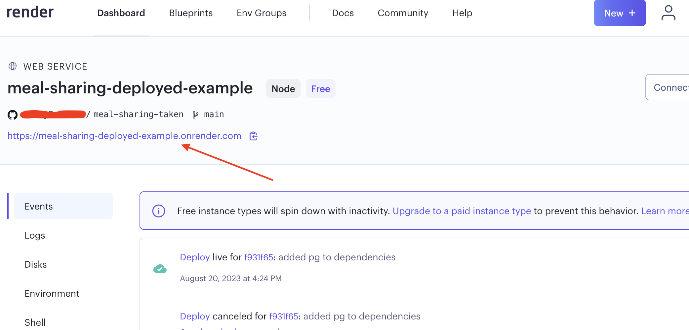

# Deployment process
For the deployment of the Meal Sharing app we will be using web service called [Render](https://render.com/). It is a free to use tool that we can use for the study purposes, in order to deploy our full applicaion, including database, front end and back end. 
In this guide we will try to go through all the process and deploy specific parts and see our working app as a final result.

### Getting started with Render 🏁
First, please follow the link and visit [Render](https://render.com/) website.
In order to procedd, you need to register (or login). I highly encourage to use your github account, as it would be easier to manage your app later.

If you are entering the service for the first time, you would see the dashboard with different possible options that are presented by Render to use.

We are interested only in highligted modules. 

### Database
First we need to deploy our DB. To do that, please follow [DB deployment guide](Deployment_DB.md).

### WebService
Next we need to deploy our service and client. To do that, please follow [Web service deployment guide](Deployment_Web_service.md)

When all the steps are successfully done, your dashboard should include two deployed services.

(Note that things in the picture that are red are your account names and service names that you would give to the service.)

Render would provide you with the domain that you would be using to showcase your application. You can see it if you click on the web service that you deployed and in the top of the page you would see a link to your website.

From now on your application would be automatically deployed each time when you would be pushing your changes to the branch you have specified. So, if you have specified **main** branch in [Web service deployment section](Deployment_Web_service.md), then, whenever you would be pushing, or merging your changes there, it would automatically trigger re-deployment process of your web application. This process is called Contimious Delivery (or simply CD) and it is very handy for the process of deployment and development. 