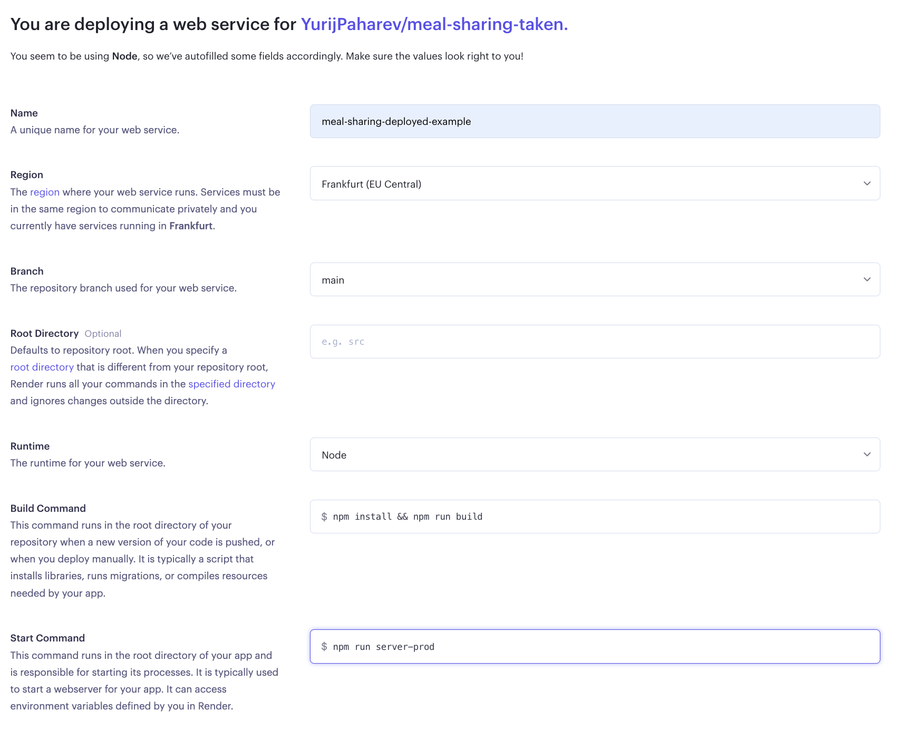

# Web service deployment
### Pre-requisites
One of the first things that we need to do - is to check if our application works localy and without any issues. For that - execute the command:
``` sh
npm start
```
Navigate to localhost:5000 in your browser (here I use port 5000 as an API_PORT) and check that your application works as expected (no errors in teminal and no errors in web console).

When you execute the command `npm start` it does two things:
1. It builds the web application - this means that it bundles all the code you wrote in one file that could be processed by the browser.
2. It serves your static files via the server. For the development you are using development server, however for the production we are serving static files from nodeJS, using:

``` js
const buildPath = path.join(__dirname, "../../dist"); // Our web files are generated to the dist folder if not chosen otherwise
app.use(express.static(buildPath)); // Express.js takes care of serving stativ files
```
For the deployment we would need to adjust our scripts in the package.json, so that we can execute them on an external server


As you see in the screenshot - you need to add 

``` json
"server-prod": "node ./src/backend/server",
```
Also, please remove next lines from package.json:
```json
"engines": {
  "node": "8.11.1"
},
```
### Additional changes
While executing the code on the server I have encountered a problem that a specific module was not working while trying to run the app. You should consider removing two lines from webpack.config.js:
``` js
const CaseSensitivePathsPlugin = require('case-sensitive-paths-webpack-plugin'); // near line 3
...
new CaseSensitivePathsPlugin(), // near line 59
```
After all these steps are done - we are ready to start deploying.

### Deployment process
First of all - push your latest changes to your repository that you will be using for debuging.
Next - go to your [Render](https://render.com/) dashboard, click `New` in the header and choose the `Web service`.


You will be taken to the page where you will need to connect your github repository (the one where you store your meal sharing) and Render. (If the list would be empty, you would be prompted to connect your github account and Render, just follow the instructions).


Press connect on the repository that holds your code and you will be redirected to the page where you will be able to see the details of your newly created project.


**Name**: This is the name that would be displayed for your deployed web project in Render.

**Region**: The region where servers are stored (we should use Frankfurt).

**Branch**: Since you have connected your repository, now, whenever you will push changes to your branch - Render will automatically re-deploy your changes, so that it would be possible for you to see the latest changes in the production build (You can leave 'main' branch, or choose any branch you like)

**Root Directory**: This sets path for the server, where it would be executing its commands (we can leave it unchanged)

**Runtime**: Instrument that is used to run our code. For our case it makes sense to use Node

**Build Command**: Scripts that would run to build our project (we need to paste `npm install && npm run build` - it will take care of installing all the dependencies and building our Client code)

**Start Command**: Script that would start our server and serve our Client code and API (we should use `npm run server-prod` that we establised in the begining of the guide).



After filling the form - scroll down and press **Create Web Service**.
You will be redirected to the deployment screen with displayed terminal, where you will be able to see all the logs and errors that you might need to fix, before deploying.


You should encounter an error like this and this is because we have not added any environment variables for our server.


Click on **Environment** on the left side and the **Add Environment Variable** button.

You should take your environment variable key names from your .env file. 


In order to fill your DB variables, go to your **Connections** in your deployed DB and copy information from there (for the host, simply use the **Host** mentioned in the list of elements since it is an internal coonection on one server). After you filled all the information - press **Save Changes** and press **Manual deploy** in the top of the page.


Then return to the **Logs** page and check if everything was built successfully


Please note - you can switch to **Events** tab that would show you that build was successfull, or something failed and to the **Logs** - where you can go into more details.

In order to see your site running, simply follow the link in your browser that is presented in the top left corner of your Render page 


